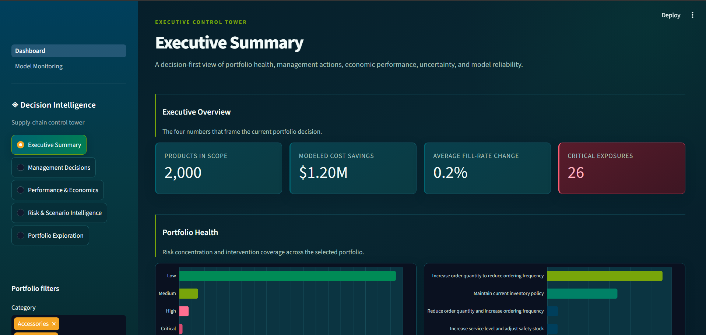
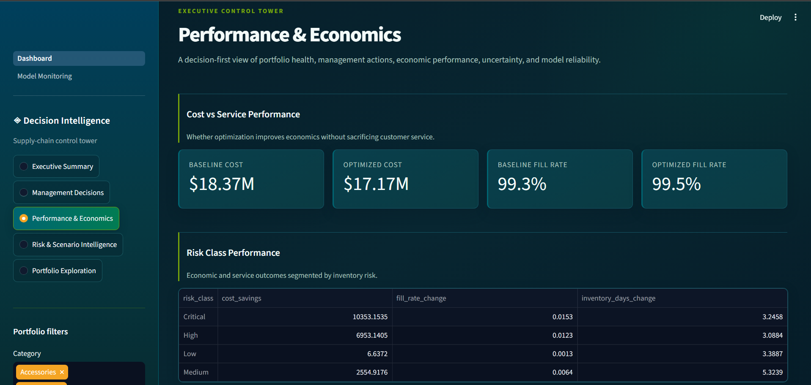
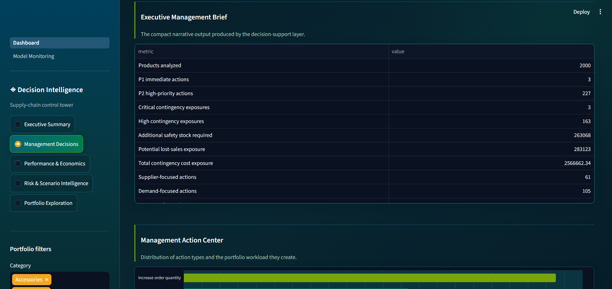
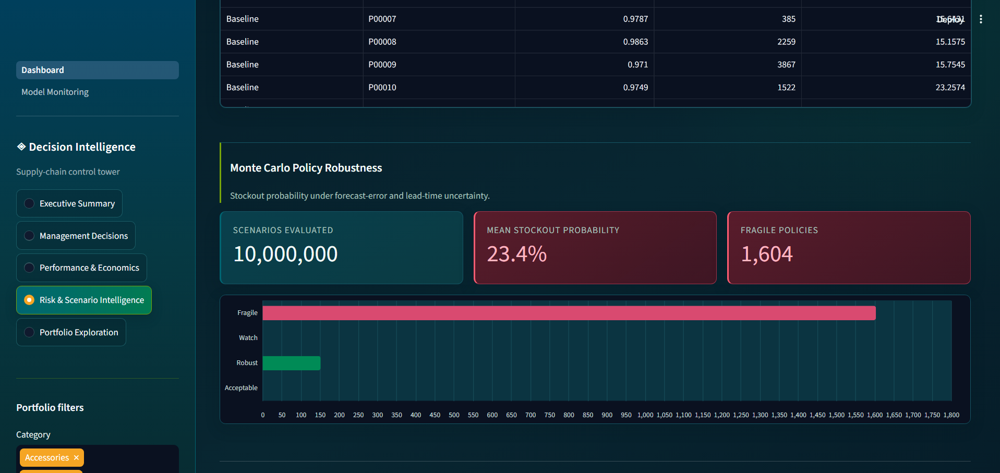
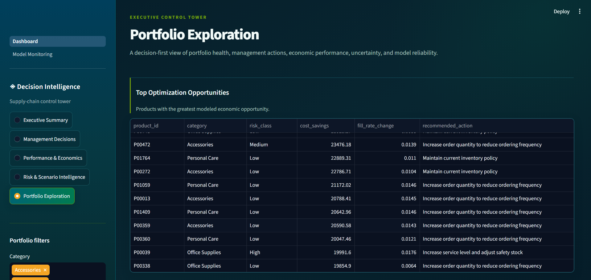
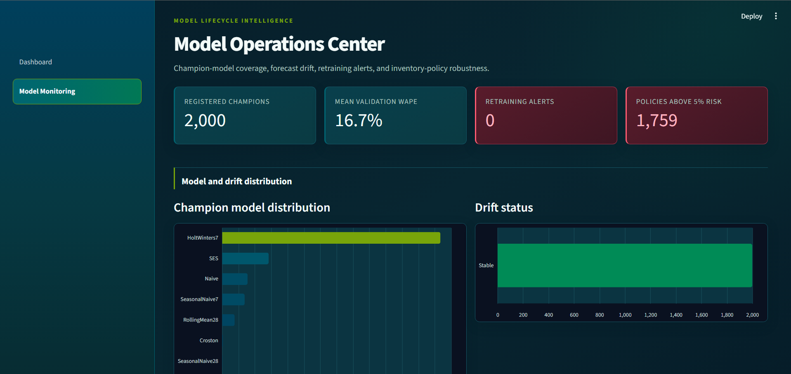
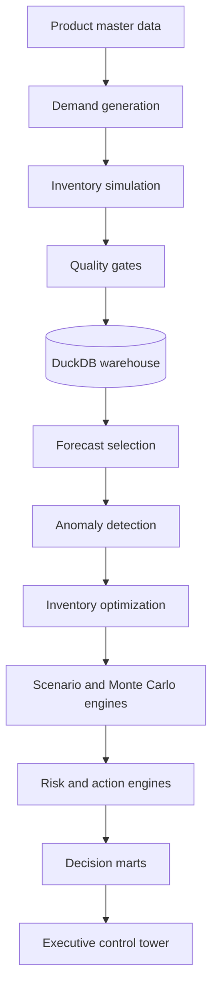

<div align="center">

# Supply Chain Decision Intelligence Platform

### A production-style data platform that turns 2.9 million operational records into forecasts, inventory policies, risk signals, and management actions.

[](https://www.python.org/)
[](https://duckdb.org/)
[](https://streamlit.io/)
[](#quality-and-reproducibility)
[](#pipeline)

**Data Engineering · Forecasting · Decision Science · MLOps · Business Intelligence**

</div>



---

## The idea

Most supply-chain dashboards explain what has already happened. This project
goes further: it builds a governed path from raw operational data to an
explainable decision.

The platform generates and validates product-level operations, selects a
forecasting model for every SKU, detects unusual demand, optimizes inventory
policy, stress-tests recommendations under uncertainty, and presents the result
through an executive control tower.

It is designed around four questions:

1. **What is happening across the portfolio?**
2. **What is likely to happen next?**
3. **What should management do?**
4. **What are the cost, service, and risk implications?**

---

## Results at a glance

| Portfolio result | Outcome |
|---|---:|
| Products modeled | **2,000** |
| Demand records | **1,460,000** |
| Inventory-operation records | **1,460,000** |
| Forecast horizon | **30 days per product** |
| Registered champion models | **2,000** |
| Mean validation WAPE | **16.7%** |
| Baseline portfolio cost | **$18.37M** |
| Optimized portfolio cost | **$17.17M** |
| Modeled cost savings | **$1.20M** |
| Fill rate | **99.3% → 99.5%** |
| Monte Carlo scenarios | **10,000,000** |
| Critical inventory exposures | **26** |

The probabilistic layer uncovered an important gap hidden by deterministic
optimization: **1,604 policies were classified as fragile** when forecast error
and lead-time uncertainty were simulated together. That finding turns the
project from an optimization demo into a genuine decision-risk system.

> All data is synthetic and all financial values are modeled estimates. Results
> demonstrate analytical methodology rather than real operational performance.

---

## Dashboard

The interface contains **24 analytical sections organized into five decision
layers**, preventing executive summaries, action lists, and risk outputs from
competing on one oversized page.

| Layer | Management question |
|---|---|
| Executive Summary | What is happening? |
| Management Decisions | What should we do? |
| Performance & Economics | Did optimization improve the business? |
| Risk & Scenario Intelligence | What could undermine the plan? |
| Portfolio Exploration | Where should an analyst investigate? |

### Performance and management decisions

<table>
  <tr>
    <td width="50%"></td>
    <td width="50%"></td>
  </tr>
</table>

### Risk, exploration, and model operations

<table>
  <tr>
    <td width="50%"></td>
    <td width="50%"></td>
  </tr>
  <tr>
    <td colspan="2"></td>
  </tr>
</table>

---

## Architecture



The application does not recalculate business rules. Forecasting, optimization,
risk scoring, and executive actions are produced upstream and exposed through
governed decision marts.

---

## What the platform includes

### Data engineering

- Configuration-driven orchestration with declared inputs and outputs
- Dependency-aware execution, partial reruns, and failure recovery
- Data-quality checks for schemas, nulls, duplicates, ranges, and referential integrity
- Explicit detection of invalid Git LFS pointer files
- SHA-256 output fingerprints and timestamped JSON run metadata
- DuckDB warehouse with `core`, `marts`, and `metadata` schemas

### Forecasting and anomaly detection

Every product competes across forecasting approaches suited to its demand
behavior:

- Holt-Winters exponential smoothing
- Simple Exponential Smoothing
- Seasonal and non-seasonal naive models
- Rolling-mean baselines
- Croston forecasting for intermittent demand

Rolling validation selects a champion model for each product. Forecast
residuals then provide dynamic anomaly baselines rather than relying on fixed
business thresholds.

### Model lifecycle

- Deterministic model version for every champion
- Training-data and forecasting-code fingerprints
- Validation metrics, training history, and forecast lineage
- Registered forecast artifacts
- Data-drift and performance-drift monitoring
- Retraining recommendations and alert outputs

### Inventory and decision science

- Safety stock and reorder-point calculation
- Service-level and order-coverage optimization
- Holding, ordering, and lost-sales economics
- Supplier-delay and contingency exposure
- Scenario analysis and executive action prioritization
- Monte Carlo stress testing with 5,000 simulations per product

---

## Warehouse

| Schema | Asset | Grain |
|---|---|---|
| `core` | `dim_product` | Product |
| `core` | `dim_date` | Calendar date |
| `core` | `fact_demand` | Product × day |
| `core` | `fact_inventory` | Product × day |
| `core` | `fact_forecast` | Product × forecast date |
| `marts` | `mart_inventory_decision` | Product recommendation |
| `marts` | `mart_supply_chain_risk` | Product risk profile |
| `marts` | `mart_model_registry` | Product champion model |
| `marts` | `mart_model_monitoring` | Product drift status |
| `marts` | `mart_monte_carlo_risk` | Product policy robustness |

---

## Pipeline

```text
generate_demand            simulate_inventory
data_quality               forecast_demand
detect_anomalies           register_models
monitor_models             inventory_risk
optimize_inventory         monte_carlo_inventory
optimization_decisions     scenario_simulation
scenario_analysis          scenario_decisions
economic_validation        contingency_planning
executive_actions          supply_chain_risk
build_warehouse
```

Every execution writes an auditable record to `data/metadata/runs/`, including
step status, duration, captured errors, and output fingerprints.

---

## Technology

| Area | Tools |
|---|---|
| Language | Python 3.12 |
| Transformation | Pandas, NumPy |
| Forecasting | Statsmodels, custom Croston and baseline models |
| Warehouse and SQL | DuckDB |
| Visualization | Streamlit, Altair |
| Testing | Pytest, Streamlit AppTest |
| Orchestration | Configuration-driven Python runner, TOML |
| Deployment | GitHub Actions, optional Docker and Compose |

---

## Run locally

### 1. Create the environment

```powershell
py -3.12 -m venv .venv
.venv\Scripts\Activate.ps1
python -m pip install --upgrade pip
pip install -r requirements.txt
```

### 2. Preview and run the pipeline

```powershell
python python\data_engineering\run_pipeline.py --dry-run
python python\data_engineering\run_pipeline.py
```

The complete run processes 2.9 million product-day records and can take time.
A failed stage can be resumed without starting from the beginning:

```powershell
python python\data_engineering\run_pipeline.py --from economic_validation --force
```

### 3. Launch the control tower

```powershell
streamlit run dashboard\app.py
```

Open `http://localhost:8501`.

### 4. Run the tests

```powershell
python -m pytest -q
```

Expected result:

```text
7 passed
```

Docker is optional. Local Python and Streamlit are sufficient to run the full
project. Deployment details are available in
[`docs/DEPLOYMENT.md`](docs/DEPLOYMENT.md).

---

## Repository structure

```text
├── assets/images/              # Dashboard screenshots
├── config/pipeline.toml        # Pipeline dependency graph
├── dashboard/
│   ├── app.py                  # Five-layer control tower
│   └── pages/                  # Model Operations Center
├── data/
│   ├── raw/                    # Source product data
│   ├── processed/              # Generated analytical outputs
│   ├── warehouse/              # DuckDB database
│   └── metadata/runs/          # Execution records
├── models/
│   ├── registry/               # Champion registry and lineage
│   ├── artifacts/              # Registered forecast artifacts
│   └── experiments/            # Experiment metadata
├── python/
│   ├── data_engineering/
│   ├── data_generation/
│   ├── preprocessing/
│   ├── forecasting/
│   ├── anomaly_detection/
│   ├── simulation/
│   ├── optimization/
│   ├── modeling/
│   └── risk/
├── tests/
├── Dockerfile
├── requirements.txt
└── README.md
```

---

## Quality and reproducibility

- **7 automated tests** cover pipeline safety, model versioning, simulation
  reproducibility, monitoring severity, dashboard structure, and deployment assets.
- GitHub Actions compiles the code, runs tests, validates the orchestration graph,
  and builds the optional container image.
- Large reproducible facts, warehouse files, model artifacts, and run logs are
  intentionally excluded from Git.

---

## Next steps

- Calibrate inventory policies against probabilistic service targets
- Add formal feature and schema contracts
- Introduce scheduled retraining and model promotion rules
- Compare statistical champions with gradient-boosted global forecasting models
- Deploy the control tower to a public cloud environment

---

<div align="center">

### Built to connect engineering, prediction, and action—not just display another dashboard.

</div>
